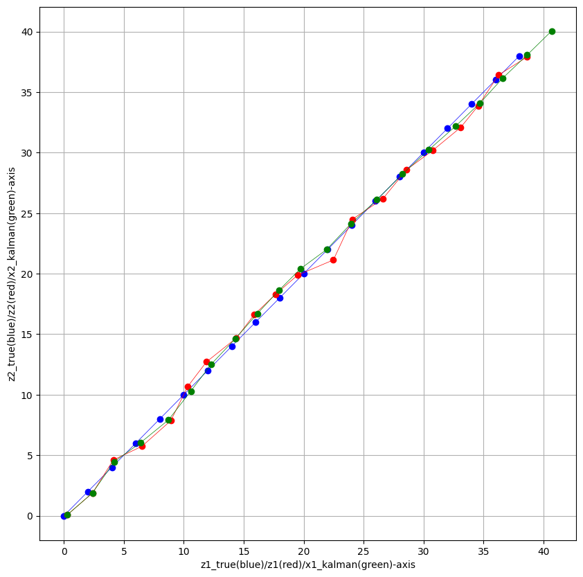

## Importing modules

We start by importing the modules that we will use

```python
import random 
import numpy as np
from matplotlib import pyplot as plt
```

If one or more modules are missing you can just type the code below in order to install a pip package in the current Jupyter kernel. For example, if numpy is missing, then we can use  

```python
import sys
!{sys.executable} -m pip install numpy
```

    Requirement already satisfied: numpy in c:\users\hp\appdata\local\programs\python\python311\lib\site-packages (1.24.1)
    

## Defining the main functions

We will know define all the functions that give us the necessary values in order to solve our problem, given a certain input.

#### (a) noise_creator 

Due to the fact that the measurements $z_k$ are not given, we have to "create" them based on the hypotheses.  
In order to do that, we first need to get $k_{upper}$ values of the noise vectors $w_k$ and $\nu_k$, with $w_k \sim \mathcal{N}(0,Q)$ and $\nu_k \sim \mathcal{N}(0,R)$.  
As input we will have the values $k_{upper}, \Delta t, q_1, q_2, \sigma_1, \sigma_2$ in order to keep the functions general enough for them to work for different values of them.


```python
def noise_creator(k_upper,DT,q1,q2,sigma1,sigma2):

    #creating x_noise 
    mean_x = [0,0,0,0]
    cov_x = [[1/3*q1*(DT**3), 0, 1/2*q1*(DT**2), 0], 
             [0, 1/3*q2*(DT**3), 0, 1/2*q2*(DT**2)], 
                      [1/2*q1*(DT**2), 0, q1*DT, 0], 
                      [0, 1/2*q2*(DT**2), 0, q2*DT]]
    x_noise = np.zeros((k_upper, 4))

    for i in range(0,k_upper):
        x_noise[i] = np.random.multivariate_normal(mean_x, cov_x)

    #creating z_noise
    mean_z = [0,0]
    cov_z = [[sigma1**2, 0], [0, sigma2**2]]
    z_noise = np.zeros((k_upper, 2))

    for i in range(0,k_upper):
        z_noise[i] = np.random.multivariate_normal(mean_z, cov_z)
        
    return mean_x, cov_x, mean_z, cov_z, x_noise, z_noise
```

#### (b) xz_creator

After getting the $w_k$ and $\nu_k$ vector values for $k=0,\dots,k_{upper}$, we can now find the appropriate $x_k$ and $z_k$ from 
\begin{equation*}
\begin{aligned}
x_k & = Ax_{k-1} + w_{k-1} \\
z_k & = Hx_{k-1} + \nu_{k-1} \\
\end{aligned}
\end{equation*}
The only extra input that we need is the starting position and speed which are contained in the starting vector $x_0=(x_{0,1}, x_{0,2}, x_{0,3}, x_{0,4})$.


```python
def xz_creator(k_upper,DT, q1, q2, sigma1, sigma2, x_0):

    #creating noise
    mean_x, cov_x, mean_z, cov_z, x_noise, z_noise = noise_creator(k_upper,DT,q1,q2,sigma1,sigma2)
    
    #starting position and speed
    x_01, x_02, x_03, x_04 = x_0[0], x_0[1], x_0[2], x_0[3]
    
    #creating x
    x = np.zeros((k_upper,4))
    x[0] = [x_01, x_02, x_03, x_04]

    for i in range(0,k_upper-1):
        x_i = np.transpose(x[i])
        x_noise_i = np.transpose(x_noise[i])
        x_iplus1 = np.transpose(np.matmul(A, x_i) + x_noise_i)
        x[i+1] = np.transpose(x_iplus1)

    #creating z
    z = np.zeros((k_upper,2))

    for i in range(0,k_upper):
        x_i = np.transpose(x[i])
        z_noise_i = np.transpose(z_noise[i])
        z_i = np.transpose(np.matmul(H, x_i) + z_noise_i)
        z[i] = np.transpose(z_i)
        
    return mean_x, cov_x, mean_z, cov_z, x_noise, z_noise, x, z
```

#### (c) true_measurements

We would also like to have the noise-free measurements ${z_{true}}_k$ of the position, given the starting position and thinking that the starting speed $(u_1,u_2)=(x_{0,3} \; x_{0,4})$ will stay the same throughout the motion. Basically, we can get these values for $k=1, \dots, k_{upper}$ from 
$${z_{true}}_k = {z_{true}}_{k-1} + ( \, x_{0,3} \; x_{0,4} \, )^T \cdot \Delta t$$


```python
def true_measurements(k_upper,DT,x_0):

    #starting place and speed
    x_01, x_02, x_03, x_04 = x_0[0], x_0[1], x_0[2], x_0[3]

    z_true = np.zeros((k_upper,2))
    z_true[0] = [x_01, x_02]

    speed_true = np.array([x_03, x_04]) #true speed remains the same

    for i in range(0,k_upper-1):
        z_true[i+1] = z_true[i] + speed_true*DT
        
    return z_true
```

#### (d) kalman_filter

For this function we will need to make two more assumptions about the nature of (i) the starting covariance matrix $P_0(+)$ and (ii) the starting $x_0(+)$ which will have to be inputted to the function. Moreover, we will need the $z_k$ measurements which we can get from the previous functions as well as some other known values. Then, using the 4-step process found below we can calculate all the estimations needed from the Kalman filtering process, for $k=1,\dots, k_{upper}$:

1. $P_k(-) = AP_{k-1}A^T + Q \; \; $ and $ \; \; \hat{x}_k(-)=A*\hat{x}_{k-1}(+)$
2. $K_k = P_k(-)H^T(HP_k(-)H^T+R)^{-1}$
3. $P_k(+) = (I-K_kH)P_k(-)$
4. $\hat{x}_k(+)=(I-K_kH)\hat{x}_k(-)+K_kz_k$  

Furthermore, we will also make a prediction on the values for the next step, with $k=k_{upper}+1$, using the final known measurement $z_{k_{upper}}$.


```python
def kalman_filter(k_upper, x_0, P_plus_before, z):
       
    P_plus_list = []
    P_minus_list = []
    x_plus_list = [] 
    x_minus_list = []
    K_list = []

    #adding the P_0(+) and x_0(+) values to the lists
    P_plus_list.append(P_plus_before)

    x_plus_list.append(x_0)


    for i in range(0,k_upper):

        #calculate P_minus
        calc11 = np.matmul(A, P_plus_list[i])
        calc12 = np.matmul(calc11, np.transpose(A))
        P_minus_i = calc12 + cov_x
        P_minus_list.append(P_minus_i)

        #calculate x_minus
        x_minus_i = np.matmul(A, x_plus_list[i])
        x_minus_list.append(x_minus_i)

        #calculate K
        calc21 = np.matmul(P_minus_list[i], np.transpose(H))
        calc22 = np.matmul(H, P_minus_list[i])
        calc23 = np.matmul(calc22, np.transpose(H))
        calc24 = calc23 + cov_z
        calc25 = np.linalg.inv(calc24)
        K_i = np.matmul(calc21, calc25)
        K_list.append(K_i)

        #calculate P_plus
        I=[[1,0,0,0],
         [0,1,0,0],
         [0,0,1,0],
         [0,0,0,1]]
        calc31 = np.matmul(K_list[i], H)
        calc32 = I - calc31
        P_plus_i = np.matmul(calc32, P_minus_list[i])
        P_plus_list.append(P_plus_i)

        #calculate x_plus
        calc41 = np.matmul(calc32, x_minus_list[i])
        calc42 = np.matmul(K_list[i], z[i])
        x_plus_i = calc41 + calc42
        x_plus_list.append(x_plus_i)

    #before using the values
    P_plus_list.pop(0) #we remove our first guess for k=0
    x_plus_list.pop(0) #we remove our first guess for k=0

    #guess on the 21first time

    j = k_upper-1
    #calculate P_minus
    calc21_1 = np.matmul(A, P_plus_list[j])
    calc21_2 = np.matmul(calc21_1, np.transpose(A))
    P_minus_j = calc21_2 + cov_x
    P_minus_list.append(P_minus_j)

    #calculate x_minus
    x_minus_j = np.matmul(A, x_plus_list[j])
    x_minus_list.append(x_minus_j)

    x_plus_list.append(x_minus_j)
                  
    return P_minus_list, P_plus_list, x_minus_list, x_plus_list, K_list
```

## Defining the output functions

After creating the main functions in order to get the values that we wanted, we know have to create some functions in order to visualize our results better.

#### (a) plot_creator

Firstly, we create a function that will visualize the measurements without noise ${z_{true}}_k$, the measurements with noise $z_k$ and the filtered results $x_k(+)$ together on the same plot.


```python
def plot_creator(z, z_true, x_plus_list):

    fig = plt.figure(figsize=((10,10)))

    z1_true_plot = []
    z2_true_plot = []
    for z_true_i in z_true:
        z1_true_plot.append(z_true_i[0])
        z2_true_plot.append(z_true_i[1])

    plt.plot(z1_true_plot, z2_true_plot, linewidth = 0.5, **{'color': 'blue', 'marker': 'o'})
    
    z1_plot = []
    z2_plot = []
    for z_i in z:
        z1_plot.append(z_i[0])
        z2_plot.append(z_i[1])

    plt.plot(z1_plot, z2_plot, linewidth = 0.5, **{'color': 'red', 'marker': 'o'})

    x1_kal_plot = []
    x2_kal_plot = []
    for x_kal_i in x_plus_list:
        x1_kal_plot.append(x_kal_i[0])
        x2_kal_plot.append(x_kal_i[1])

    plt.plot(x1_kal_plot, x2_kal_plot, linewidth = 0.5, **{'color': 'green', 'marker': 'o'})

    plt.grid()
    plt.xlabel('z1_true(blue)/z1(red)/x1_kalman(green)-axis')
    plt.ylabel('z2_true(blue)/z2(red)/x2_kalman(green)-axis')
    plt.axis("tight")
    plt.show()
```

#### (b) table_printer

Lastly, we need a function that can showcase the most important results that we got from our previous functions in order to compare them. The values compared are evident from the tables*.  

*Further optimization needed on their appearance.


```python
def table_printer(k_upper, x_noise, z_noise, z_true, x_plus_list, P_minus_list, P_plus_list):
    
    #table1
    print("k || x_k,1-noise | x_k,2-noise | x_k,3-noise | x_k,4-noise | z_k,1-noise | z_k,2-noise |")
    print("----------------------------------------------------------------------------------------")

    for k in range(0,k_upper):
        x1_noise_k = x_noise[k][0]
        x2_noise_k = x_noise[k][1]
        x3_noise_k = x_noise[k][2]
        x4_noise_k = x_noise[k][3]

        z1_noise_k = z_noise[k][0]
        z2_noise_k = z_noise[k][0]

        print(str(k+1) + " ||   " + str(float("{:.4f}".format(x1_noise_k))) + "   ||   "\
              + str(float("{:.4f}".format(x2_noise_k))) + "   ||   " + str(float("{:.4f}".format(x3_noise_k))) + "   ||   "\
              + str(float("{:.4f}".format(x4_noise_k))) + "   ||   " + str(float("{:.4f}".format(z1_noise_k))) + "   ||   "\
              + str(float("{:.4f}".format(z2_noise_k))))
        
    #----
    print("")
    print("")
    print("")
    #----
       
    #table2 & prediction
    print("k || z_k,1-true | z_k,2-true | x_k,1 | x_k,2 | p_k,11(-) | p_k,11(+) | p_k,22(-) | p_k,22(+) ")
    print("---------------------------------------------------------------------------------------------")

    for k in range(0,k_upper):
        z1_true_k = z_true[k][0]
        z2_true_k = z_true[k][1]

        z1_k = z_true[k][0]
        z2_k = z_true[k][1]

        x1_kal_k = x_plus_list[k][0]
        x2_kal_k = x_plus_list[k][1]

        p1_minus_var_k = P_minus_list[k][0][0]
        p2_minus_var_k = P_minus_list[k][1][1]

        p1_plus_var_k = P_plus_list[k][0][0]
        p2_plus_var_k = P_plus_list[k][1][1]

        print(str(k+1) + " ||    " + str(float("{:.4f}".format(z1_true_k))) + "    ||    "\
              + str(float("{:.4f}".format(z2_true_k))) + "    || " + str(float("{:.4f}".format(x1_kal_k))) + " || "\
              + str(float("{:.4f}".format(x2_kal_k))) + " || " + str(float("{:.4f}".format(p1_minus_var_k))) + " || "\
              + str(float("{:.4f}".format(p1_plus_var_k))) + " || " + str(float("{:.4f}".format(p2_minus_var_k))) + " || "\
              + str(float("{:.4f}".format(p2_plus_var_k))))

    x1_kal_k_upperplus1 = x_plus_list[k_upper][0]
    x2_kal_k_upperplus1 = x_plus_list[k_upper][1]

    print(str(k_upper+1) + " ||     " + "    " + "     ||   " + "    " + "     || "\
          + str(float("{:.4f}".format(x1_kal_k_upperplus1))) + " || " + str(float("{:.4f}".format(x2_kal_k_upperplus1))))
    
    #----
    print("")
    print("")
    print("")
    #----
    
    #table 3 & prediction
    print("k || u_1 | u_2 | x_k,3 | x_k,4 | p_k,33(-) | p_k,33(+) | p_k,44(-) | p_k,44(+) ")
    print("-------------------------------------------------------------------------------")
    
    for k in range(0,k_upper):

        x3_kal_k = x_plus_list[k][2]
        x4_kal_k = x_plus_list[k][3]

        x3_kal_21 = x_plus_list[20][2]
        x4_kal_21 = x_plus_list[20][3]

        p3_minus_var_k = P_minus_list[k][2][2]
        p4_minus_var_k = P_minus_list[k][3][3]

        p3_plus_var_k = P_plus_list[k][2][2]
        p4_plus_var_k = P_plus_list[k][3][3]


        print(str(k+1) + " ||   " + str(float("{:.4f}".format(x_03))) + "   || " + str(float("{:.4f}".format(x_04)))\
              + "   || " + str(float("{:.4f}".format(x3_kal_k))) + " || " + str(float("{:.4f}".format(x4_kal_k)))\
              + " || " + str(float("{:.4f}".format(p3_minus_var_k))) + " || " + str(float("{:.4f}".format(p3_plus_var_k)))\
              + " || " + str(float("{:.4f}".format(p4_minus_var_k))) + " || " + str(float("{:.4f}".format(p4_plus_var_k))))

    x3_kal_k_upperplus1 = x_plus_list[20][2]
    x4_kal_k_upperplus1 = x_plus_list[20][3]
    print(str(k_upper + 1) + " || " + "   " + " || " + "   " + " ||   "\
          + str(float("{:.4f}".format(x3_kal_k_upperplus1))) + " || " + str(float("{:.4f}".format(x4_kal_k_upperplus1)))) 
```

## Solving the problem

For the assignment we will use all the above functions with the following input:  
$\cdot$ $k_{upper}=20$, $\Delta t = 0.1$, $q_1=q_2=1$, $\sigma_1=\sigma_2=1/2$, $x_0=(0, 0, 10, 10)$  
$\cdot$ $x_0(+)=x_0$ and $P_0(+)= \left( \begin{array}{cccc}
1000 & 0.4 & 0.4 & 0.4 \\
0.4 & 1000 & 0.4 & 0.4 \\
0.4 & 0.4 & 1000 & 0.4 \\
0.4 & 0.4 & 0.4 & 1000
\end{array} \right)$  
$\cdot$ $A$ and $H$ as defined at the start.


```python
#input
k_upper=20
DT = 0.1
q1, q2 = 1, 1
sigma1, sigma2 = 1/2, 1/2
x_0 =(x_01, x_02, x_03, x_04) = (0, 0, 20, 20) #starting hidden values (we start at (0,0) with a speed of (...) in each direction)

A=[ [1, 0, DT, 0], 
    [0, 1, 0, DT], 
     [0, 0, 1, 0],
     [0, 0, 0, 1]]

H = [[1, 0, 0, 0],
     [0, 1, 0, 0]]

P_plus_before = [[1000,0.4,0.4,0.4],
                 [0.4,1000,0.4,0.4],
                 [0.4,0.4,1000,0.4],
                 [0.4,0.4,0.4,1000]]
#input

#values from functions
mean_x, cov_x, mean_z, cov_z, x_noise, z_noise, x, z = xz_creator(k_upper, DT, q1, q2, sigma1, sigma2, x_0)
z_true = true_measurements(k_upper, DT,x_0)
P_minus_list, P_plus_list, x_minus_list, x_plus_list, K_list = kalman_filter(k_upper, x_0, P_plus_before, z)
```


```python
#plot creation
plot_creator(z, z_true, x_plus_list)
```


    

    


```python
#table creation
table_printer(k_upper, x_noise, z_noise, z_true, x_plus_list, P_minus_list, P_plus_list)
```

    k || x_k,1-noise | x_k,2-noise | x_k,3-noise | x_k,4-noise | z_k,1-noise | z_k,2-noise |
    ----------------------------------------------------------------------------------------
    1 ||   -0.0008   ||   0.0198   ||   0.0123   ||   0.2783   ||   0.2784   ||   0.2784
    2 ||   -0.0041   ||   0.0102   ||   0.0804   ||   0.3972   ||   0.3931   ||   0.3931
    3 ||   -0.0081   ||   0.005   ||   -0.0551   ||   -0.0998   ||   0.1307   ||   0.1307
    4 ||   -0.0204   ||   -0.0002   ||   -0.4824   ||   0.1173   ||   0.5105   ||   0.5105
    5 ||   0.0157   ||   -0.02   ||   0.2857   ||   -0.5402   ||   0.9372   ||   0.9372
    6 ||   0.0054   ||   0.0008   ||   0.2565   ||   -0.2174   ||   0.3902   ||   0.3902
    7 ||   0.0196   ||   0.0044   ||   0.441   ||   0.1074   ||   -0.0515   ||   -0.0515
    8 ||   -0.0054   ||   -0.0153   ||   -0.0348   ||   -0.3062   ||   0.4119   ||   0.4119
    9 ||   0.0097   ||   -0.0126   ||   0.1055   ||   -0.159   ||   -0.1452   ||   -0.1452
    10 ||   0.0107   ||   -0.0104   ||   0.3259   ||   -0.1719   ||   -0.412   ||   -0.412
    11 ||   -0.0026   ||   -0.0189   ||   -0.0517   ||   -0.2491   ||   -0.6593   ||   -0.6593
    12 ||   -0.001   ||   0.0237   ||   -0.1755   ||   0.1132   ||   0.2387   ||   0.2387
    13 ||   0.0039   ||   0.0521   ||   -0.158   ||   0.3926   ||   -0.2732   ||   -0.2732
    14 ||   -0.0196   ||   -0.0356   ||   -0.3465   ||   -0.2449   ||   0.1966   ||   0.1966
    15 ||   -0.008   ||   -0.0124   ||   -0.0897   ||   -0.2036   ||   0.1385   ||   0.1385
    16 ||   -0.004   ||   0.0034   ||   -0.003   ||   -0.092   ||   0.3196   ||   0.3196
    17 ||   0.0164   ||   0.0219   ||   0.4004   ||   0.2014   ||   0.6425   ||   0.6425
    18 ||   0.0117   ||   -0.0105   ||   0.4445   ||   -0.0932   ||   0.0719   ||   0.0719
    19 ||   -0.0163   ||   0.0091   ||   -0.1332   ||   0.1065   ||   -0.2929   ||   -0.2929
    20 ||   0.0155   ||   -0.0297   ||   -0.0055   ||   -0.274   ||   -0.0106   ||   -0.0106
    
    
    
    k || z_k,1-true | z_k,2-true | x_k,1 | x_k,2 | p_k,11(-) | p_k,11(+) | p_k,22(-) | p_k,22(+) 
    ---------------------------------------------------------------------------------------------
    1 ||    0.0    ||    0.0    || 0.2788 || 0.0718 || 1010.0803 || 0.2499 || 1010.0803 || 0.2499
    2 ||    2.0    ||    2.0    || 2.3891 || 1.8893 || 10.1565 || 0.244 || 10.1565 || 0.244
    3 ||    4.0    ||    4.0    || 4.1909 || 4.4567 || 1.1962 || 0.2068 || 1.1962 || 0.2068
    4 ||    6.0    ||    6.0    || 6.3895 || 6.0342 || 0.5782 || 0.1745 || 0.5782 || 0.1745
    5 ||    8.0    ||    8.0    || 8.7236 || 7.9162 || 0.3754 || 0.1501 || 0.3754 || 0.1501
    6 ||    10.0    ||    10.0    || 10.5894 || 10.2991 || 0.2776 || 0.1315 || 0.2776 || 0.1315
    7 ||    12.0    ||    12.0    || 12.2952 || 12.5252 || 0.2211 || 0.1173 || 0.2211 || 0.1173
    8 ||    14.0    ||    14.0    || 14.3197 || 14.6511 || 0.1851 || 0.1063 || 0.1851 || 0.1063
    9 ||    16.0    ||    16.0    || 16.138 || 16.7005 || 0.1607 || 0.0978 || 0.1607 || 0.0978
    10 ||    18.0    ||    18.0    || 17.9374 || 18.6171 || 0.1437 || 0.0913 || 0.1437 || 0.0913
    11 ||    20.0    ||    20.0    || 19.7349 || 20.4029 || 0.1317 || 0.0863 || 0.1317 || 0.0863
    12 ||    22.0    ||    22.0    || 21.9159 || 21.9921 || 0.1232 || 0.0825 || 0.1232 || 0.0825
    13 ||    24.0    ||    24.0    || 23.9277 || 24.1086 || 0.1173 || 0.0798 || 0.1173 || 0.0798
    14 ||    26.0    ||    26.0    || 26.1113 || 26.1101 || 0.1132 || 0.0779 || 0.1132 || 0.0779
    15 ||    28.0    ||    28.0    || 28.2548 || 28.2358 || 0.1106 || 0.0767 || 0.1106 || 0.0767
    16 ||    30.0    ||    30.0    || 30.4292 || 30.2211 || 0.1089 || 0.0758 || 0.1089 || 0.0758
    17 ||    32.0    ||    32.0    || 32.6678 || 32.1785 || 0.1079 || 0.0754 || 0.1079 || 0.0754
    18 ||    34.0    ||    34.0    || 34.694 || 34.0781 || 0.1073 || 0.0751 || 0.1073 || 0.0751
    19 ||    36.0    ||    36.0    || 36.6147 || 36.1599 || 0.107 || 0.075 || 0.107 || 0.075
    20 ||    38.0    ||    38.0    || 38.6487 || 38.0754 || 0.1069 || 0.0749 || 0.1069 || 0.0749
    21 ||              ||            || 40.6933 || 40.0555
    
    
    
    k || u_1 | u_2 | x_k,3 | x_k,4 | p_k,33(-) | p_k,33(+) | p_k,44(-) | p_k,44(+) 
    -------------------------------------------------------------------------------
    1 ||   20.0   || 20.0   || 19.8282 || 19.8077 || 1000.1 || 990.1218 || 1000.1 || 990.1218
    2 ||   20.0   || 20.0   || 21.0714 || 18.2151 || 990.2218 || 47.6031 || 990.2218 || 47.6031
    3 ||   20.0   || 20.0   || 19.2474 || 22.6702 || 47.7031 || 12.4071 || 47.7031 || 12.4071
    4 ||   20.0   || 20.0   || 20.4225 || 19.7119 || 12.5071 || 5.0763 || 12.5071 || 5.0763
    5 ||   20.0   || 20.0   || 21.4033 || 19.4122 || 5.1763 || 2.6318 || 5.1763 || 2.6318
    6 ||   20.0   || 20.0   || 20.6394 || 20.6415 || 2.7318 || 1.6008 || 2.7318 || 1.6008
    7 ||   20.0   || 20.0   || 19.7788 || 21.0303 || 1.7008 || 1.102 || 1.7008 || 1.102
    8 ||   20.0   || 20.0   || 19.879 || 21.0795 || 1.202 || 0.8396 || 1.202 || 0.8396
    9 ||   20.0   || 20.0   || 19.5443 || 20.9639 || 0.9396 || 0.6947 || 0.9396 || 0.6947
    10 ||   20.0   || 20.0   || 19.2556 || 20.6293 || 0.7947 || 0.613 || 0.7947 || 0.613
    11 ||   20.0   || 20.0   || 19.026 || 20.1323 || 0.713 || 0.5668 || 0.713 || 0.5668
    12 ||   20.0   || 20.0   || 19.5149 || 19.3876 || 0.6668 || 0.5414 || 0.6668 || 0.5414
    13 ||   20.0   || 20.0   || 19.6199 || 19.6969 || 0.6414 || 0.528 || 0.6414 || 0.528
    14 ||   20.0   || 20.0   || 20.005 || 19.7521 || 0.628 || 0.5214 || 0.628 || 0.5214
    15 ||   20.0   || 20.0   || 20.254 || 20.0143 || 0.6214 || 0.5186 || 0.6214 || 0.5186
    16 ||   20.0   || 20.0   || 20.5145 || 19.986 || 0.6186 || 0.5176 || 0.6186 || 0.5176
    17 ||   20.0   || 20.0   || 20.8432 || 19.9138 || 0.6176 || 0.5174 || 0.6176 || 0.5174
    18 ||   20.0   || 20.0   || 20.7407 || 19.7521 || 0.6174 || 0.5174 || 0.6174 || 0.5174
    19 ||   20.0   || 20.0   || 20.47 || 19.9403 || 0.6174 || 0.5174 || 0.6174 || 0.5174
    20 ||   20.0   || 20.0   || 20.4469 || 19.8014 || 0.6174 || 0.5172 || 0.6174 || 0.5172
    21 ||     ||     ||   20.4469 || 19.8014

<style>
@import url("https://cdn.jsdelivr.net/npm/jupyter-css@0.1.0/dist/jupyter-css-light.min.css");
</style>
    
<script type="text/javascript">
document.addEventListener('DOMContentLoaded', (event) => {
  const codeBlocks = document.querySelectorAll('pre.highlight');
  codeBlocks.forEach((codeBlock) => {
    codeBlock.classList.add('language-python');
  });
});
</script>
